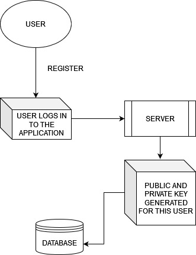
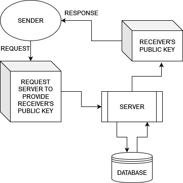
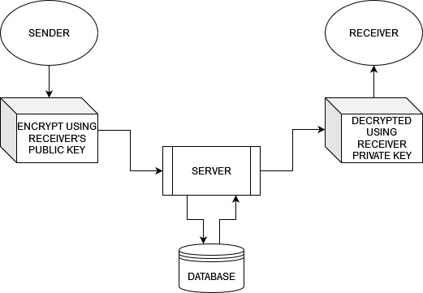

# EncryptedChat
One to One chat system based on end to end encryption

## How it works

* This system implements end to end encryption using RSA algorithm. The secure transmission is achieved using public and private keys. 
* Every user has his own confidential private key, with which the user can decrypt the received messages. 
* Every user has his won public key, using which the sender encrypts the messages for that particular user. 

> A message encrypted with public key of user ABC can be decrypted only using the private key of user ABC

## How this is achieved

The public and private keys of all the users ae stored in a secure database.

### How keys are generated for a new user

 
* When a new user registers, a public key and private key is generated for the user and stored in the database.

### How a user receives his private key on login

 
* When a user logs in securely, the private key is provided.  
This private key gets stored as a cookie variable and remains in the browser as long as the TTL ends or the user logs out. 
* Note that remember me feature is not provided here as sessions might require storing the private key as a cookie for longer time which might make it vunerable. 

### How a sender gets the receiver's public key

 
* In order to obtain the receiver's public key which is stored in the database, the sender requests the server. 
The server upon receiving this request sends the desired user's public key to the receiver.

### How a message is sent using end-to-end encryption

 
STEP 1: Sender to database
* The sender receives the receiver's public key from the server.
* The sender adds one or more salt to the message.
* This hashed message is encrypted using the public key of the receiver.
* This encrypted message is sent to the Server.
* The server upon receiving this encrypted message stores it in the database.
  
STEP 2: Database to receiver
* The receiver logs in and receives his private key.
* The receiver makes a request to recieve all recent/unread messages receieved.
* The encrypted message stored in the database is sent to the receiver by the server.
* The receiver decrypts the message using his own private key.
* The receiver removes the previously applied salt from the message.
* Thus, the receiver receives the final message.